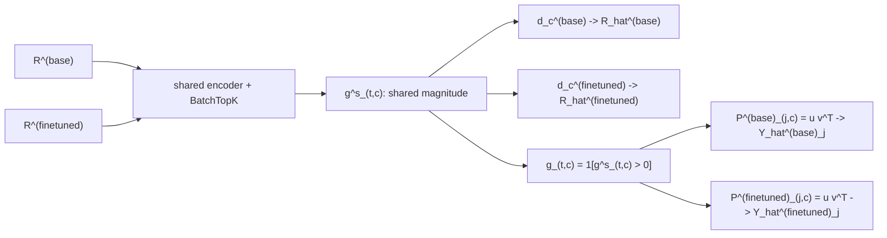

# Multi-model ASPD: code-to-notation guide

This implementation learns one sparse coordinate `c` across `N` models. It combines activation
diffing and ASPD without assuming that a separately trained component in one model corresponds to a
component with the same index in another model.



The upper branch is the crosscoder-like activation decomposition. The lower branch is ASPD's
parameter-space computation. Their shared feature index `c` is what makes a direct comparison
possible.

## How to follow the inline computations

Every tensor calculation in `batch_topk.py`, `losses.py`, `components.py`, `model.py`, `cache.py`,
`training.py`, `analysis.py`, and `causal.py` is accompanied by a nearby worked comment. The small
numbers are illustrative rather than runtime constants. They consistently use the note's indices:

- `n`: model; usually `N=2` for base and finetuned;
- `j`: selected weight matrix;
- `t`: common token position;
- `c`: shared latent/mechanism index;
- `g^s_{t,c}`: non-negative activation magnitude used by `D^(n)`;
- `g_{t,c}=1[g^s_{t,c}>0]`: binary gate used by `P_{j,c}^{(n)}`.

Follow one minibatch in this order: `cache.iter_batches` gives `R^(n),X_j^(n)`; `encode` produces
`g^s,g`; `ActivationDecoders.reconstruct` produces `R_hat^(n)`;
`RankOneComponents.reconstruct` produces `Y_hat_j^(n)`; `_objective` combines their FVU terms;
`analysis.py` converts the learned tensors into `rho`, `beta`, `tilde_rho`, and `pi`.

## What one latent means

For the same token sequence and position `t`, model `n` produces a grounding activation
`R[n][:, t] = r_t^(n)`. `MultiModelASPD.encoder` reads every `R^(n)` and produces one non-negative
code:

```
R^(1), ..., R^(N) -> a_{t,c} -> BatchTopK -> g^s_{t,c}
```

`g^s_{t,c}` has two roles:

1. `ActivationDecoders` reconstruct each model's activation with its own `d_c^(n)`:
   `r_hat_t^(n) = sum_c g^s_{t,c} d_c^(n) + b^(n)`.
2. `SparseCode.gate` computes the ASPD gate `g_{t,c} = 1[g^s_{t,c} > 0]`. The same binary gate
   controls component `c` in every selected matrix and every model.

For matrix `j` in model `n`, `RankOneComponents.V[c]` is `v_{j,c}^(n)` and
`RankOneComponents.U[c]` is `u_{j,c}^(n)`. `RankOneComponents.reconstruct` evaluates ASPD Eq. 1:

```
e_{j,t,c}^(n) = g_{t,c} (v_{j,c}^(n)T x_{j,t}^(n))
y_hat_{j,t}^(n) = sum_c e_{j,t,c}^(n) u_{j,c}^(n)
```

Only active `(t,c)` pairs are evaluated. This is mathematically the same sum and avoids dense work
over all `C` components.

## Tensor names

| Notation | Code | Shape |
|---|---|---|
| `N` | `len(cfg.models)` | scalar |
| `C` | `cfg.sparsity.n_features` | scalar |
| `R^(n)` | `batch["R"][n]` | `[B,T,d_act^(n)]` |
| `X_j^(n)` | `batch["X"][n][j]` | `[B,T,d_in,j^(n)]` |
| `W_j^(n)` | `FrozenWeight.weight` | `[d_out,j^(n),d_in,j^(n)]` |
| `g^s_{t,c}` | `SparseCode.values` | `[B,T,C]` |
| `g_{t,c}` | `SparseCode.gate` | `[B,T,C]`, bool |
| `d_c^(n)` | `ActivationDecoders.weight(n)[c]` | `[d_act^(n)]` |
| `u_{j,c}^(n)` | `component_factors(n,j)[0][c]` | `[d_out,j^(n)]` |
| `v_{j,c}^(n)` | `component_factors(n,j)[1][c]` | `[d_in,j^(n)]` |
| `P_{j,c}^(n)` | outer product of the preceding `u,v` | not materialized |

## D0, D1, and D2

- **D0** applies one BatchTopK selection to all `C` features. Shared and exclusive features are
  labels assigned after training from `rho` and `tilde_rho`.
- **D1** places designated-shared features first in `[0,C_shared)` and exclusive candidates after
  them. The two blocks receive independent BatchTopK budgets. A shared label in D1 is still a
  training prior unless tying is enabled.
- **D1 tied** uses the same `Parameter` for `d_c`, `u_{j,c}`, and `v_{j,c}` in the shared block.
  It forces the shared computation to be identical for a same-architecture pair.
- **D2** adds `gamma * L(S)`. `L(S)` reconstructs all activations and matrix computations with the
  shared block alone. Exclusive decoder and component parameters do not occur in `L(S)`; the
  gradient-isolation test verifies this property.

## S1 and S2

`batch_topk` always writes the original activation `a_{t,c}` into `g^s`. It changes only the score
used to select the support:

- S1: `omega_c = 1`.
- S2: `omega_c = sum_n ||d_c^(n)||_2` from
  `ActivationDecoders.relative_norm_weights`.

The S2 norm is detached during discrete selection. No accidental differentiable decoder-norm loss
is introduced.

## Objective and reductions

`MultiModelASPD._objective` computes

```
sum_n [ mean_j FVU(Y_j^(n), Y_hat_j^(n))
        + lambda_act * FVU(R^(n), R_hat^(n)) ]
```

Activation FVU is averaged over ASPD Matryoshka prefixes. `DeadFeatureTracker` and `_auxk_loss`
implement dead-feature revival.

- `N=1`, one matrix, D0: ASPD with a cached activation source.
- `N=1`, several matrices: Range-ASPD.
- `N=2`, empty matrix lists, linear encoder: BatchTopK crosscoder.
- `N=2`, matrices present: the requested joint activation and parameter diffing method.

The success criterion is internal reconstruction `Y_hat_j^(n) ~= W_j^(n) X_j^(n)`. The code never
optimizes `sum_c P_{j,c}^(n) ~= W_j^(n)`.

## What "shared component" means

There are two measurements:

- P1 `rho_c^(n)` measures activation decoder mass.
- P2 `tilde_rho_c^(n)` measures the RMS computation written by the rank-1 mechanisms when `c`
  fires, normalized by the scale of each matrix output.

A common feature with a common computation has both quantities close to `1/N` and compatible
loci `pi_c^(n)(j)`. A feature can be shared in activation space but concentrated in parameter
space; that is a computational difference which an activation-only crosscoder cannot see.
